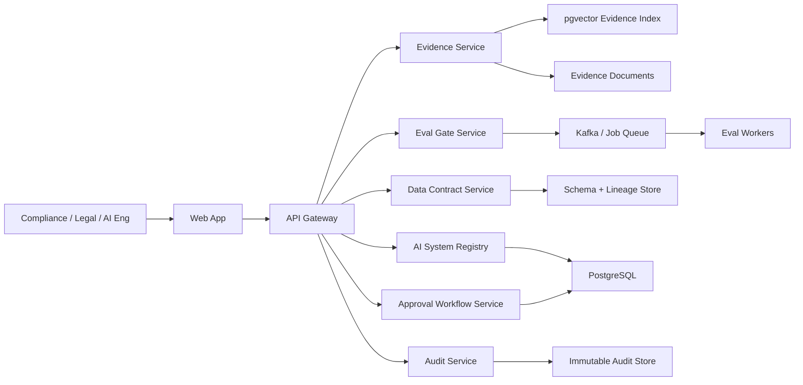

# Architecture

## System Overview

EU AI Assurance OS is designed as a multi-tenant SaaS control plane.

## Services

### API Gateway

Handles auth, tenant context, request validation, rate limiting, and routing.

### Registry Service

Owns AI systems, risk classification, ownership, release status, model metadata, and deployment context.

### Evidence Service

Ingests documents and answers compliance questions with citations. Production version uses embeddings, hybrid search, reranking, and answer generation.

### Eval Gate Service

Stores eval datasets, eval runs, thresholds, model/prompt versions, and release decisions.

### Data Contract Service

Tracks source schema contracts, semantic contracts, lineage, drift events, and remediation status.

### Workflow Service

Manages approvals, blocked releases, compensating actions, reviewer assignments, and human oversight steps.

### Audit Service

Append-only event stream for all compliance-relevant actions.

## Recommended Backend Stack

Option A: Spring Boot 3

- Spring Web
- Spring Security
- Spring Data JPA
- PostgreSQL
- Redis
- Kafka
- Flyway
- Testcontainers

Option B: FastAPI

- FastAPI
- SQLAlchemy
- PostgreSQL
- Redis
- Kafka or Celery
- Alembic
- Pytest

Spring Boot is a strong fit because the Java PRDs emphasize regulated backend systems, auditability, multi-tenancy, SAGA-style workflows, and enterprise deployment.

## Release Gate Logic

Pass:

- Evidence coverage above threshold.
- Eval score above threshold.
- Data contract status healthy.
- Required approvals completed.

Review:

- Minor evidence gaps.
- Eval close to threshold.
- Data contract warning.
- Approval pending.

Blocked:

- High-risk system missing required oversight evidence.
- Eval below hard threshold.
- Data contract breach.
- Privacy or security control failed.
- Critical audit trail missing.

## Tenant Isolation

MVP can use tenant discriminator columns. Production can move enterprise tenants to schema-per-tenant or dedicated deployment when needed.

## Audit Strategy

Every critical action emits an audit event:

- AI system created or modified.
- Risk class changed.
- Evidence query answered.
- Eval run completed.
- Data contract drift detected.
- Release decision calculated.
- Approval or override submitted.
- Evidence pack exported.

Audit events should be immutable after append.
