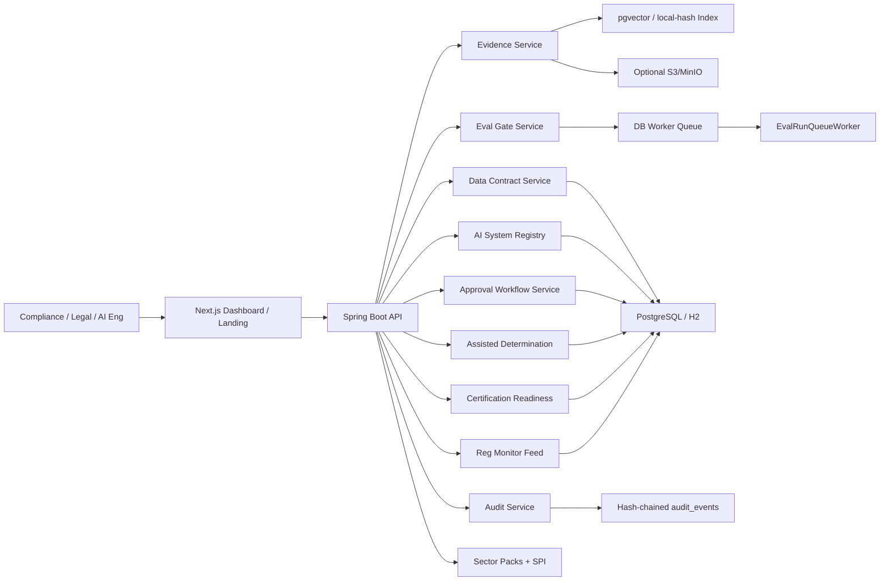

# Architecture

## System Overview

EU AI Assurance OS is a multi-tenant SaaS governance control plane. **Implemented stack:** Spring Boot 3.3 API + Next.js 16 dashboard + PostgreSQL (or H2 for local tests). Kafka is **not** required; the eval worker uses a durable DB claim queue.

## Services

### API (monolith domain modules)

Single deployable Spring Boot app under `os.assurance.eu.api`. Domain packages map to capabilities (not separate microservices in the MVP/enterprise slice):

| Package / area | Responsibility |
|---|---|
| `system` | AI system CRUD, risk classification, release gate, evidence pack, CI gate |
| `control` | Controls catalog + system-control status |
| `evidence` | Ingestion, chunking, embedding, cited RAG query |
| `eval` | Datasets, runs, background worker, HMAC callback |
| `contract` | Data contracts, drift events, status rollup |
| `workflow` | Approval workflows, stages, notifications |
| `audit` | Append-only hash-chained events + verify |
| `auth` | JWT, refresh tokens, JWKS, OAuth Google/Microsoft, API keys |
| `tenant` | Tenant context filter, RBAC authorization |
| `determination` | Assisted obligation questionnaire + ruleset |
| `readiness` | Certification readiness score + gaps (not legal cert) |
| `regmonitor` | Polled regulatory change feed + impact hints |
| `sector` | Sector packs SPI + insurance connector stubs |

### Dashboard (Next.js)

- Route group `app/(dashboard)/` with shared sidebar/header.
- Public marketing: landing, login, request-demo, privacy, terms, refunds, disclaimer.
- Product routes: command, systems, approvals, evidence, evals, contracts, audit, readiness, reg-monitor.
- BFF-style proxy to Spring API; session via httpOnly cookies; browser never trusts client-supplied tenant headers.

### Evidence Service

Ingests documents and answers compliance questions with citations. Pipeline: `EvidenceIngestionGuard` → `EvidenceChunker` → `EvidenceEmbeddingService`. Providers: `local-hash` (dev/H2) or `djl-sentence` (postgres). Optional object store for upload bytes.

### Eval Gate Service

Stores datasets, runs, thresholds, model/prompt versions, and release decisions. `EvalRunQueueWorker` polls the DB (configurable interval) and claims runs with select-for-update-skip-locked. Callbacks require `X-Eval-Timestamp` + `X-Eval-Signature: v1=<hmac-sha256>`.

### Data Contract Service

Tracks contracts, drift events, and remediation. Status rolls up to the system and release gate.

### Workflow Service

Manages multi-stage approvals (ENG_LEAD → COMPLIANCE → LEGAL_SIGNOFF), overrides, human oversight evidence, and notifications.

### Audit Service

Append-only **hash-chained** ledger in PostgreSQL/H2 (`prev_event_hash`, `event_hash`, `retain_until`). No public update/delete API. Verify: `GET /api/v1/audit/verify` and `GET /api/v1/audit-events/verify-chain`. Chain HMAC secret: `AUDIT_CHAIN_SECRET`.

### Assisted expansions (Phase 7)

- **Determination:** questionnaire + deterministic rules → obligation map; never auto-applies risk class.
- **Readiness:** weighted score 0–100 + gaps; never returns `certified: true`.
- **Reg monitor:** polled sources + curated bootstrap; impact hints prefer `UNCERTAIN`.
- **Sector packs:** insurance / HR / finance overlays + SPI stubs (not live vendor apps).

## Backend stack (as shipped)

- Spring Boot 3.3, Java 17, Spring Web, Spring Security (filter-level auth gate), Spring Data JPA
- Flyway V1–V16 (+ postgres-only V4 pgvector)
- PostgreSQL production path; H2 for default tests
- Optional Redis is **not** required for core paths
- Optional Kafka is **not** required (DB worker is enough)
- Actuator health / metrics / prometheus scrape endpoints
- Docker Compose + Terraform skeleton under `infra/`

## Release Gate Logic

Implemented in `ReleaseGateService` → `ReleaseDecision` (`PASS` / `REVIEW` / `BLOCKED`):

**Pass-oriented conditions:**

- Evidence coverage above threshold (indexed documents present).
- Latest completed eval score meets threshold.
- Data contract status healthy.
- Required controls not blocked; high-risk human oversight evidence as applicable.

**Review:**

- Minor evidence gaps, eval near threshold, data contract warning, open approval workflow.

**Blocked:**

- High-risk system missing required oversight evidence.
- Eval below hard threshold.
- Data contract breach.
- Blocked system control (`CONTROL:{code}`).
- Critical privacy/security control failed.

CI machine contract: `GET /api/v1/ci/release-gate?systemId=` (same engine; exit codes for bots). See `docs/OPS.md`.

## Tenant Isolation

- Tenant discriminator columns on every tenant-owned table.
- `TenantContextFilter` resolves tenant/actor **only** from verified JWT or API key. Client `X-Tenant-Id` / `X-Actor-Id` are not trusted for authorization.
- All JPA repositories scope by `tenantId`.
- Regression: `TenantIsolationTest` in CI.
- Enterprise option later: schema-per-tenant or dedicated deployment (not required for current ship).

## Audit Strategy

Every critical action emits an audit event, including:

- AI system created or modified; risk class changed.
- Evidence query answered; evidence pack exported (JSON/PDF).
- Eval run completed / retried.
- Data contract drift detected.
- Release decision calculated.
- Approval, rejection, or override submitted.
- Determination run completed; readiness assessed/exported; reg item reviewed.

Events are immutable after append (hash-chained). Retention hooks target ≥ 7 years (`retain_until`).

## Auth model

| Mechanism | Notes |
|---|---|
| Password login | `POST /auth/login` → access JWT + refresh |
| Refresh / logout | `POST /auth/refresh`, `POST /auth/logout` |
| JWKS | `GET /.well-known/jwks.json` |
| API keys | `X-Api-Key` (SHA-256 hashed at rest) for CI/service accounts |
| OAuth | Google + Microsoft authorization-code via `/auth/oauth/{provider}/start` + BFF callback POST |

OAuth: **implemented with tests**; production smoke pending — see `docs/oauth-production-smoke-test.md` and `docs/METRICS_CANONICAL.md`.

## Related docs

- `docs/SCHEMA.md` — tables aligned to Flyway
- `docs/API.md` — HTTP contract
- `docs/SECURITY.md` — threat model
- `docs/DEPLOYMENT.md` — run/deploy
- `docs/METRICS_CANONICAL.md` — measured scale facts
